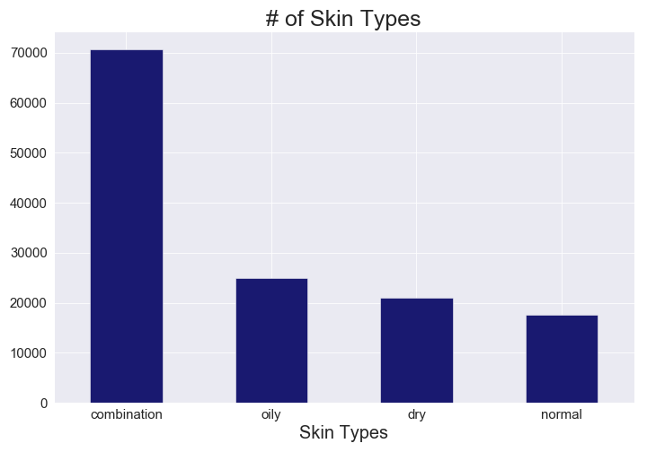
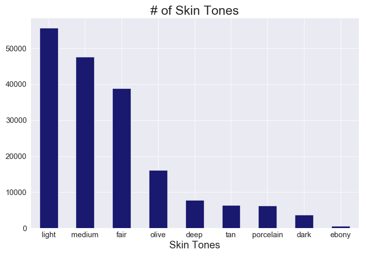
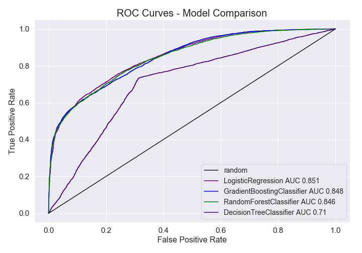
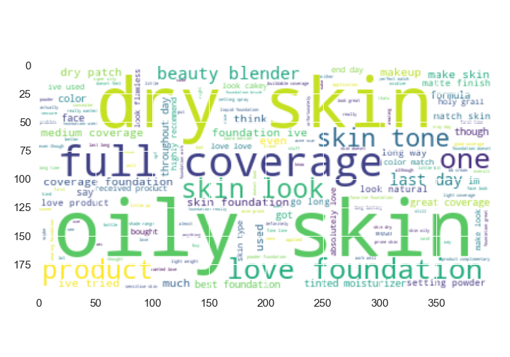

# Skin Types "Found"!

## Goal:
Is there a a way to predict skin types of reviewers based on their reviews?The purpose for this analysis was to see if skin types can be predicted based on foundation reviews.

## Data:
Foundation reviews were taken from a Sephora foundation dataset found on Github (https://github.com/san2797/SephoraFoundationReviewsAnalysis/tree/master/Datasets). This dataset contained around 276,000 row and 22 columns: 'brand', 'name', 'brand_id', 'brand_image_url', 'product_id','product_image_url', 'rating', 'skin_type', 'eye_color', 'skin_concerns', 'incentivized_review', 'skin_tone', 'age', 'beauty_insider', 'user_name', 'review_text', 'price', 'recommended', 'first_submission_date', 'last_submission_date', 'location', and 'description'.

The columns I was interested in were 'brand', 'name', 'brand_id', 'brand_image_url', 'product_id', 'rating', 'skin_type', 'eye_color', 'skin_concerns', 'skin_tone', 'age', 'review_text', 'price', 'recommended', and 'description'.

# Data Exploration:
Skin types fell into 4 different categories: combination, oily, dry, and normal. There was disproportionally high number of reviewers who had combination skin than in any other category. 

The top 3 skin tones of reviewers were ligh, medium, and fair. 

Most of these reviewers were primarily concerned with acne.

Those with Combination skin recommended a product in their review.

# Modelling 
The classifications in the data are imbalanced. There is a higher amount of reviews with Combination skin. This will cause the model to have a higher level of accuracy, as the model will want to predict based on the larger class. To fix for this, a random sample of 3,000 Combination datapoints were taken. However, based on the confusion matrix created, the model did not do a good job predicting combination skin. 

Instead, the model was tweaked to predict whether or not a reviewer had dry or oily skin. These features are independent of one another and may not pose an issue since Combinaton skin is, by classification, a mix of dry and oily.

After removing Combination and Normal skin types from the datset, there were around 46,000 reviews left. Words were tokenized and lemmatized. Logistic regression was the model that had the highest AUC and highest level of precision (77%), accuracy (75%), and recall (78%). Gradient Boosting was considered, however, this had slightly lower accuracy (78%) and recall (62%).

# Findings and Conclusion

The words "dry" and "oily" appear to be important tag words these reviews.

Interestingly, "foundation" and "skin" are the top 2 words that occur the most throughout reviews.

Based on the below, it does not appear that the occurrence of the words "dry" or "oily" are indicative of whether or not the model correctly predicts a reviewer's skin type is oily or dry.

**Next Steps**

In spite of not being able to find key words that are indicative of whether or not a reviewer has dry or oily skin, a next step of this analysis is to perform NMF and see what latent topics may appear. Perhaps the type of coverage or texture of the foundation are latent topics that will help indicate whether or not a reviewer has oily or dry skin.
