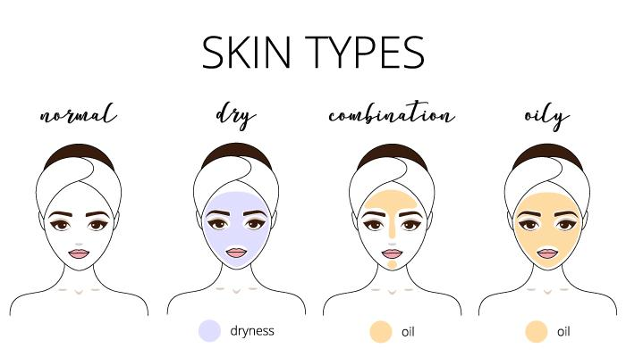
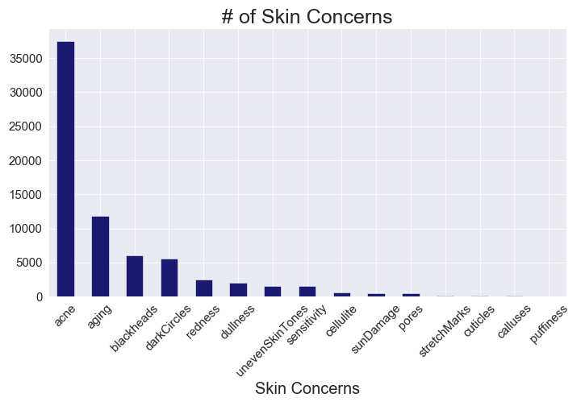
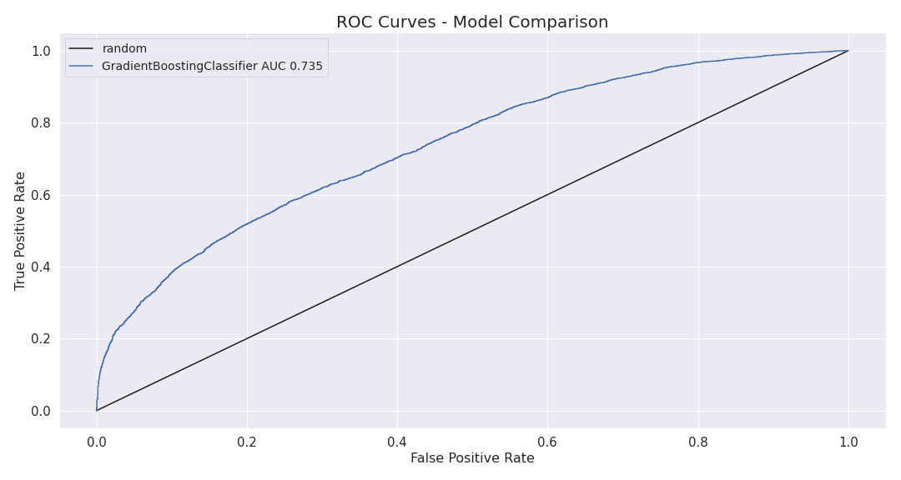
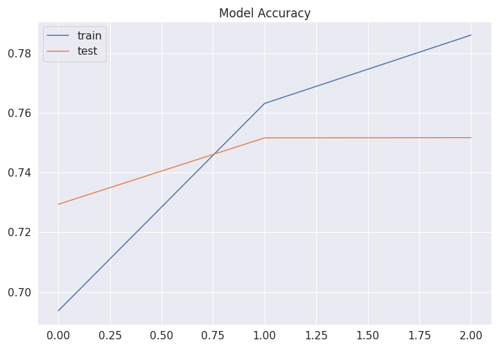
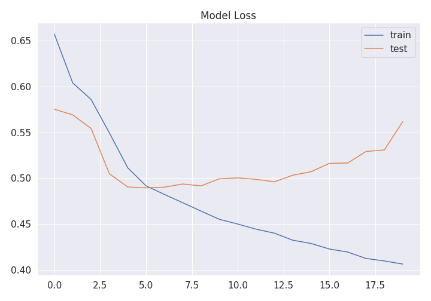

# Skin Types "Found"!
*By: Nicole Leong-Lee*

## Goal:
Over the past few years, chalk it up to fear of aging or self-maintenance, I've found myself being drawn to all things skincare. Like most consumers, I am constantly reading reviews before purchasing an item, especially products that go on my face. These reviews provide good insight for those with similar skin types on how a product will react with his/her skin. The 4 major skin type categories include normal, dry, combination, and oily. (Combination skin is classified as oily and dry skin).

    

After reading so many reviews, I wondered if there was a way to predict skin types of reviewers based on their reviews that could help companies  personalize marketing efforts to increase customer engagement. The purpose for this analysis was to see if skin types can be predicted based on foundation reviews using Long Short-Term Memory (LSTM).

## Data:
Foundation reviews were taken from a Sephora foundation dataset found on Github (https://github.com/san2797/SephoraFoundationReviewsAnalysis/tree/master/Datasets). This dataset contains around 276,000 rows and 22 columns: 'brand', 'name', 'brand_id', 'brand_image_url', 'product_id','product_image_url', 'rating', 'skin_type', 'eye_color', 'skin_concerns', 'incentivized_review', 'skin_tone', 'age', 'beauty_insider', 'user_name', 'review_text', 'price', 'recommended', 'first_submission_date', 'last_submission_date', 'location', and 'description'.

The columns I was interested in exploring were 'brand', 'name', 'brand_id', 'brand_image_url', 'product_id', 'rating', 'skin_type', 'eye_color', 'skin_concerns', 'skin_tone', 'age', 'review_text', 'recommended', and 'description'.

## Data Exploration:
There was a disproportionally high number of reviewers who had combination skin than in any other category. Because my model's goal is to predict user skin types, this class imbalance is an issue.

    

The number one concern for most foundation users was acne. These users could possibly be looking for a foundation that is good at covering up acne or does not exacerbate his/her acne.

    

I was curious to see what proportion of users recommened products. Interestingly, the proportion of recommended products to total products is consistent across all skin type categories. 

    

## Building the Models

The classifications in the data are imbalanced with a higher amount of users with Combination skin. This imbalance will cause my model to predict based on the larger class. To fix this, I decided to predict only dry and oily skin types since these classifications are balanced and independent of one another. Trying to predict combination skin would pose a challenge as this skin type is a mix of both dry and oily skin.

After removing Combination and Normal skin types from the datset, there was around 46,000 reviews left. After cleaning, I decided to lemmatize words in the reviews because I wanted to retain the base/root form of a word instead of cutting it off. I also included the words 'foundation' and 'skin' in my list of stop words since I found these words to be obvious and made only a slight difference to my model. 

## Results 
### Base Model
My base model was the Gradient Boosting Classifier with 74% accuracy, 82% precision, and 66% recall. The recall score for this model was fairly low. In my next model, I looked to improve not only my overall accuracy score, but also my recall score. A higher recall score would indicate that I had a lower number of False Negatives (predicted dry, but oily). 

I was primarily concerned with a higher recall score since there is a greater detriment of predicting dry skin types for users who actually have oily skin. This incorrect prediction would result in a user with oily skin to choose a product that is more hydrating, which might exacerbate or worsen his/her skin condition and cause more breakouts.

    

    

Based on the below, it appears that the words 'dry' and 'oily' are important features in the model.

    

### LSTM Model

For my LSTM model, I cleaned the review text and kept the same stopwords used for my Gradient Boosting Classifier, but used the Tokenizer function provided in Keras. My initial model contained 1 embedding layer and 1 LSTM layer with a 25% test size. This resulted in poor results where the model started to overfit after 1 epoch. I ended up using a Sequential Keras model with 1 embedding layer, 2 LSTM layers, and a 10% test size. 

**Initial LSTM Model**

    

    

    

**Final LSTM Model**

    

    

    

| Metric          | Score         | 
|:---------------:|:-------------:| 
| Model Score     | 48%           |
| Accuracy Score  | 75%           |  
| Precision Score | 77%           | 
| Recall Score    | 77%           | 

### New Data

How good is my model at predicting new data? I took a handful of reviews from Amazon for a face moisturizer. Since Amazon does not contain reviewer information like skin type, I wanted to see how my model performed when predicting these reviews. 

The model did an ok job at predicting oily/dry skin types. Index 4 shows a user with oily skin, but the model incorrectly predicted the user with dry skin.

    

## Recreation

EDA and initial model comparisons were done in python notebooks named 'Sephora-EDA.ipynb' and 'Reviews-Modelling_final.ipynb', respectively. See the 'LSTM_Model.ipynb' file to see visualizations of the LSTM models. 

To execute the final LSTM model (predicting dry and oily skin types), simply run the python code under the src folder titled, 'LSTM_2classes.py'. The model for the 3 classifcation LSTM model is also found under the src folder titled, 'LSTM_3classes.py'. As mentioned earlier, the dataset can be found on the Github link above named 'sephora_review_db.csv.zip'. Make sure that the dataset is saved in the same folder where the python code is executed prior to running.

## Future Work

* Webscrape more reviews to incorporate into, train, and test model
* Further improve LSTM model prediction for dry/oily skin types
* Improve the LSTM model predicting 3 classifications (skin types: oily, dry, normal)
* Predict all 4 classifications (skin types: oily, dry, normal, and combination)
 
